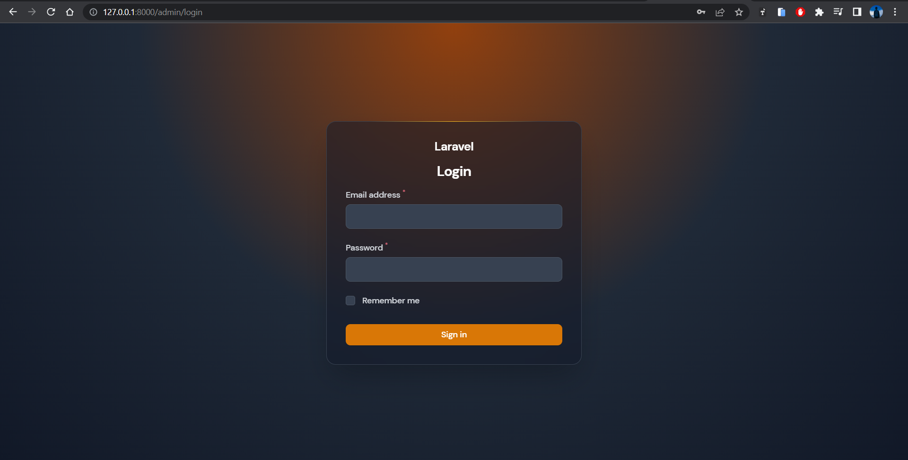

# VegeFinder API

## Table of Content

-   [Description](#description)
-   [Requirements](#requirements)
-   [Installation](#installation)
    -   [Google Cloud Storage](#google-cloud-storage)
    -   [Laravel](#laravel)
-   [Admin Dashboard](#admin-dashboard)
-   [API Usage](#api-usage)
    -   [Endpoint](#endpoints)
    -   [Endpoint that required Authentication](#endpoints)
-   [License](#license)

## Description

VegeFinder is an application that helps young people who want to start farming. The API is built using Laravel and requires PHP 8.1 and Laravel 10. It also integrates with Google Cloud Storage (GCS) for file storage.

## Requirements

-   PHP 8.1
-   Laravel 10
-   Google Cloud Storage (GCS)

## Installation

#### Google Cloud Storage

Create new project on your Google Cloud console & create new bucket on Cloud Storage with unique name

<p align="center">
    
<p>

Create new service account and grant Storage Object Admin Role

<p align="center">
    
<p>

Generate new key move to base path and rename to "service-account.json"

#### Laravel

Please check the official laravel installation guide for server requirements before you start. [Official Documentation](https://laravel.com/docs/5.4/installation#installation)

Clone the repository

    git clone https://github.com/nineneel/vegefinder-api.git

Go to the repo folder

    cd vegefinder-api

Install all the dependencies using composer

    composer install

Copy the example env file and make the required configuration changes in the .env file

    cp .env.example .env

Copy the env and put fill it with your requirement

```bash
GOOGLE_CLOUD_PROJECT_ID="[your-project-id]"
GOOGLE_CLOUD_STORAGE_BUCKET="[your-bucket-name]"
```

Change the env value

```bash
FILESYSTEM_DISK=gcs
```

Run the database migrations

    php artisan migrate --seed

Start the local development server

    php artisan serve

You can now access the server at http://localhost:8000

## Admin Dashboard

Admin dashboard help you to insert data easily. You can access the admin dashboard simply add `/admin` to your url, example: `http://localhost:8000/admin` and your will be redirect into login page.

<p align="center">
    
<p>

email: `admin@email.com`
password: `123456`

## API Usage

#### Endpoints

`http://localhost:8000/api/v1`

<details>
 <summary>Register | <code>POST</code> <code><b>/register</b></code></summary>

##### URL

`/register`

##### Method

`POST`

##### Parameters

> | key                   | type     | data type | description |
> | --------------------- | -------- | --------- | ----------- |
> | name                  | required | int       | N/A         |
> | email                 | required | string    | N/A         |
> | password              | required | string    | N/A         |
> | password_confirmation | required | string    | N/A         |
> | avatar                | required | string    | N/A         |

##### Responses

status: `201 Created`

```json
{
    "status": "success",
    "message": "User created successfully",
    "result": {
        "id": 3,
        "name": "user",
        "email": "user@example.com",
        "register_method": "manual",
        "avatar_id": "2",
        "updated_at": "2023-06-02T06:19:03.000000Z",
        "created_at": "2023-06-02T06:19:03.000000Z"
    }
}
```

status: `422 Unprocessable Content`

```json
{
    "message": "The email has already been taken. (and 2 more errors)",
    "errors": {
        "email": ["The email has already been taken."],
        "password": [
            "The password field must be at least 6 characters.",
            "The password field confirmation does not match."
        ]
    }
}
```

</details>

<details>
 <summary>Login | <code>GET</code> <code><b>/login</b></code></summary>

##### URL

`/login`

##### Method

`POST`

##### Parameters

> | key      | type     | data type | description |
> | -------- | -------- | --------- | ----------- |
> | email    | required | string    | N/A         |
> | password | required | string    | N/A         |

##### Responses

status: `200 OK`

```json
{
    "status": "success",
    "message": "Login successfully",
    "token": "346c2573164f1d5afa8db05f58935eeb.b58996c504c5638798eb6b511e6f49af"
}
```

status: `400 Bad Request`

```json
{
    "status": "failed",
    "message": "Login failed, email & password did't match"
}
```

</details>

<details>
 <summary>Home | <code>GET</code> <code><b>/home</b></code></summary>

##### URL

`/home`

##### Method

`GET`

##### Parameters

`N/A`

##### Responses

status: `200 OK`

```json
{
    "histories": [
        {
            "id": 1,
            "class_name": "bawang-bombay",
            "name": "Bawang Bombay",
            "other_name": null,
            "thumbnail": "vegetable-thumbnail/input.jpeg",
            "images": [
                "vegetable-images/input.jpeg"
            ],
            "description": "Bawang bombai (Latin: Allium Cepa Linnaeus) adalah jenis bawang yang paling banyak dan luas dibudidayakan, dipakai sebagai bumbu maupun bahan masakan, berbentuk bulat besar dan berdaging tebal. Bawang bombai biasa digunakan dalam memasak makanan di Indonesia, tidak hanya digunakan sebagai hiasan tetapi juga bagian dari masakan karena bentuknya yang besar dan tebal dagingnya. Disebut bawang bombai karena dibawa oleh pedagang-pedagang yang berasal dari kota Bombai (Mumbai sekarang) di India ke Indonesia",
            "description_source": "https://id.wikipedia.org/wiki/Bawang_bombai",
            "how_to_plant": "1. Pilih waktu yang tepat: Pilih musim kering atau kemarau, hindari memberi terlalu banyak air.\r\n2. Persiapan yang baik: Pastikan bawang bombay mendapatkan sinar matahari langsung, suhu ideal 18-20 derajat Celsius, perhatikan tanah yang gembur dengan banyak humus.\r\n3. Siapkan bibit yang akan digunakan: Pilih bawang bombay berkualitas dan berukuran besar, cuci bersih dan simpan dalam tempat lembap selama 2-3 minggu, setelah muncul tunas, tanam bibit dalam polybag dengan kedalaman 2-3 cm.\r\n4. Persiapkan tanah bedengan: Buat bedengan setebal 10-15 cm dengan lebar 1 meter, lakukan penggemburan tanah, beri pupuk kompos atau kandang seminggu sebelum penanaman.\r\n5. Penanaman bibit bawang bombay: Potong ujung umbi dan keringkan sebelum menanam, jaga jarak antar bibit 10-40 cm.",
            "how_to_plant_source": "https://www.sehatq.com/review/cara-menanam-bawang-bombay",
            "plant_care": "1. Siram secara berkala pada awal pertumbuhan.\n2. Siram ketika daun terlihat cukup kering.\n3. Lakukan penyiangan tiga minggu setelah penanaman dan ulangi enam minggu setelahnya.\n4. Jaga kebersihan tanaman dengan menghilangkan gulma dan tanaman liar di sekitarnya.\n5. Pantau dan kendalikan hama yang mungkin muncul.\n6. Gunakan pestisida organik yang aman untuk tubuh.\n7. Lakukan pembersihan hama setiap 7-10 hari.",
            "plant_care_source": "https://www.sehatq.com/review/cara-menanam-bawang-bombay",
            "plant_disease": "1. Penyakit busuk\r\n2. Bercak ungu\r\n3. Embun upas",
            "plant_disease_source": "https://dispertan.bantenprov.go.id/lama/read/artikel/566/Budidaya-Tanaman-Bombai.html#:~:text=Contoh%20penyakitnyang%20menyerang%20tanaman%20bawang,bercak%20ungu%2C%20dan%20embun%20upas.",
            "created_at": "2023-05-26T15:24:30.000000Z",
            "updated_at": "2023-05-31T04:25:34.000000Z",
            "types": [
                {
                    "id": 1,
                    "name": "Iklim Tropis",
                    "type_group_id": 1,
                    "type_group": {
                        "id": 1,
                        "name": "Ilkim"
                    }
                },
                {
                    "id": 5,
                    "name": "Iklim Sub-Tropis",
                    "type_group_id": 1,
                    "type_group": {
                        "id": 1,
                        "name": "Ilkim"
                    }
                },
                {
                    "id": 6,
                    "name": "Hidroponik",
                    "type_group_id": 2,
                    "type_group": {
                        "id": 2,
                        "name": "Media Tanam"
                    }
                }
            ]
        },
        {
            "id": 1,
            "class_name": "bawang-bombay",
            "name": "Bawang Bombay",
            "other_name": null,
            ...
        }
    ],
    "types": [
        {
            "id": 1,
            "name": "Iklim Tropis",
            "description": "Ilkim",
            "type_group_id": 1,
            "type_group": {
                "id": 1,
                "name": "Ilkim"
            }
        },
        {
            "id": 5,
            "name": "Iklim Sub-Tropis",
            "description": "Iklim Sub-Tropis",
            "type_group_id": 1,
            "type_group": {
                "id": 1,
                "name": "Ilkim"
            }
        },
        {
            "id": 6,
            "name": "Hidroponik",...
        }
    ]
}
```

</details>

<details>
 <summary>Get Home Types | <code>GET</code> <code><b>/home/types</b></code></summary>

##### URL

`/home/types`

##### Method

`GET`

##### Parameters

`N/A`

##### Responses

status: `200 OK`

```json
{
    "types": [
        {
            "id": 1,
            "name": "Iklim Tropis",
            "description": "Ilkim",
            "type_group_id": 1,
            "type_group": {
                "id": 1,
                "name": "Ilkim"
            }
        },
        {
            "id": 5,
            "name": "Iklim Sub-Tropis",
            "description": "Iklim Sub-Tropis",
            "type_group_id": 1,
            "type_group": {
                "id": 1,
                "name": "Ilkim"
            }
        },
        {
            "id": 6,
            "name": "Hidroponik",...
        }
    ]
}
```

</details>

<details>
 <summary>Get Home Histories | <code>GET</code> <code><b>/home/histories</b></code></summary>

##### URL

`/home/histories`

##### Method

`GET`

##### Parameters

`N/A`

##### Responses

status: `200 OK`

```json
{
    "histories": [
        {
            "id": 1,
            "class_name": "bawang-bombay",
            "name": "Bawang Bombay",
            "other_name": null,
            "thumbnail": "vegetable-thumbnail/input.jpeg",
            "images": [
                "vegetable-images/input.jpeg"
            ],
            "description": "Bawang bombai (Latin: Allium Cepa Linnaeus) adalah jenis bawang yang paling banyak dan luas dibudidayakan, dipakai sebagai bumbu maupun bahan masakan, berbentuk bulat besar dan berdaging tebal. Bawang bombai biasa digunakan dalam memasak makanan di Indonesia, tidak hanya digunakan sebagai hiasan tetapi juga bagian dari masakan karena bentuknya yang besar dan tebal dagingnya. Disebut bawang bombai karena dibawa oleh pedagang-pedagang yang berasal dari kota Bombai (Mumbai sekarang) di India ke Indonesia",
            "description_source": "https://id.wikipedia.org/wiki/Bawang_bombai",
            "how_to_plant": "1. Pilih waktu yang tepat: Pilih musim kering atau kemarau, hindari memberi terlalu banyak air.\r\n2. Persiapan yang baik: Pastikan bawang bombay mendapatkan sinar matahari langsung, suhu ideal 18-20 derajat Celsius, perhatikan tanah yang gembur dengan banyak humus.\r\n3. Siapkan bibit yang akan digunakan: Pilih bawang bombay berkualitas dan berukuran besar, cuci bersih dan simpan dalam tempat lembap selama 2-3 minggu, setelah muncul tunas, tanam bibit dalam polybag dengan kedalaman 2-3 cm.\r\n4. Persiapkan tanah bedengan: Buat bedengan setebal 10-15 cm dengan lebar 1 meter, lakukan penggemburan tanah, beri pupuk kompos atau kandang seminggu sebelum penanaman.\r\n5. Penanaman bibit bawang bombay: Potong ujung umbi dan keringkan sebelum menanam, jaga jarak antar bibit 10-40 cm.",
            "how_to_plant_source": "https://www.sehatq.com/review/cara-menanam-bawang-bombay",
            "plant_care": "1. Siram secara berkala pada awal pertumbuhan.\n2. Siram ketika daun terlihat cukup kering.\n3. Lakukan penyiangan tiga minggu setelah penanaman dan ulangi enam minggu setelahnya.\n4. Jaga kebersihan tanaman dengan menghilangkan gulma dan tanaman liar di sekitarnya.\n5. Pantau dan kendalikan hama yang mungkin muncul.\n6. Gunakan pestisida organik yang aman untuk tubuh.\n7. Lakukan pembersihan hama setiap 7-10 hari.",
            "plant_care_source": "https://www.sehatq.com/review/cara-menanam-bawang-bombay",
            "plant_disease": "1. Penyakit busuk\r\n2. Bercak ungu\r\n3. Embun upas",
            "plant_disease_source": "https://dispertan.bantenprov.go.id/lama/read/artikel/566/Budidaya-Tanaman-Bombai.html#:~:text=Contoh%20penyakitnyang%20menyerang%20tanaman%20bawang,bercak%20ungu%2C%20dan%20embun%20upas.",
            "created_at": "2023-05-26T15:24:30.000000Z",
            "updated_at": "2023-05-31T04:25:34.000000Z",
            "types": [
                {
                    "id": 1,
                    "name": "Iklim Tropis",
                    "type_group_id": 1,
                    "type_group": {
                        "id": 1,
                        "name": "Ilkim"
                    }
                },
                {
                    "id": 5,
                    "name": "Iklim Sub-Tropis",
                    "type_group_id": 1,
                    "type_group": {
                        "id": 1,
                        "name": "Ilkim"
                    }
                },
                {
                    "id": 6,
                    "name": "Hidroponik",
                    "type_group_id": 2,
                    "type_group": {
                        "id": 2,
                        "name": "Media Tanam"
                    }
                }
            ]
        },
        {
            "id": 1,
            "class_name": "bawang-bombay",
            "name": "Bawang Bombay",
            "other_name": null,
            ...
        }
    ]
}
```

</details>

<details>
 <summary>Get User | <code>GET</code> <code><b>/user</b></code></summary>

##### URL

`/user`

##### Method

`GET`

##### Parameters

`N/A`

##### Responses

status : `200 OK`

```json
{
    "id": 2,
    "name": "user",
    "email": "user@example.com",
    "api_token": "346c2573164f1d5afa8db05f58935eeb.b58996c504c5638798eb6b511e6f49af",
    "avatar": "avatar/avatar1.png"
}
```

</details>

<details>
 <summary>Get Prediction | <code>POST</code> <code><b>/predict</b></code></summary>

##### URL

`/predict`

##### Method

`POST`

##### Parameters

> | key   | type     | data type | description |
> | ----- | -------- | --------- | ----------- |
> | image | required | file      | N/A         |

##### Responses

status : `200 OK`

```json
{
    "status": "success",
    "vegetable": {
        "id": 1,
        "class_name": "bawang-bombay",
        "name": "Bawang Bombay",
        "other_name": null,
        "thumbnail": "vegetable-thumbnail/input.jpeg",
        "images": ["vegetable-images/input.jpeg"],
        "description": "Bawang bombai (Latin: Allium Cepa Linnaeus) adalah jenis bawang yang paling banyak dan luas dibudidayakan, dipakai sebagai bumbu maupun bahan masakan, berbentuk bulat besar dan berdaging tebal. Bawang bombai biasa digunakan dalam memasak makanan di Indonesia, tidak hanya digunakan sebagai hiasan tetapi juga bagian dari masakan karena bentuknya yang besar dan tebal dagingnya. Disebut bawang bombai karena dibawa oleh pedagang-pedagang yang berasal dari kota Bombai (Mumbai sekarang) di India ke Indonesia",
        "description_source": "https://id.wikipedia.org/wiki/Bawang_bombai",
        "how_to_plant": "1. Pilih waktu yang tepat: Pilih musim kering atau kemarau, hindari memberi terlalu banyak air.\r\n2. Persiapan yang baik: Pastikan bawang bombay mendapatkan sinar matahari langsung, suhu ideal 18-20 derajat Celsius, perhatikan tanah yang gembur dengan banyak humus.\r\n3. Siapkan bibit yang akan digunakan: Pilih bawang bombay berkualitas dan berukuran besar, cuci bersih dan simpan dalam tempat lembap selama 2-3 minggu, setelah muncul tunas, tanam bibit dalam polybag dengan kedalaman 2-3 cm.\r\n4. Persiapkan tanah bedengan: Buat bedengan setebal 10-15 cm dengan lebar 1 meter, lakukan penggemburan tanah, beri pupuk kompos atau kandang seminggu sebelum penanaman.\r\n5. Penanaman bibit bawang bombay: Potong ujung umbi dan keringkan sebelum menanam, jaga jarak antar bibit 10-40 cm.",
        "how_to_plant_source": "https://www.sehatq.com/review/cara-menanam-bawang-bombay",
        "plant_care": "1. Siram secara berkala pada awal pertumbuhan.\n2. Siram ketika daun terlihat cukup kering.\n3. Lakukan penyiangan tiga minggu setelah penanaman dan ulangi enam minggu setelahnya.\n4. Jaga kebersihan tanaman dengan menghilangkan gulma dan tanaman liar di sekitarnya.\n5. Pantau dan kendalikan hama yang mungkin muncul.\n6. Gunakan pestisida organik yang aman untuk tubuh.\n7. Lakukan pembersihan hama setiap 7-10 hari.",
        "plant_care_source": "https://www.sehatq.com/review/cara-menanam-bawang-bombay",
        "plant_disease": "1. Penyakit busuk\r\n2. Bercak ungu\r\n3. Embun upas",
        "plant_disease_source": "https://dispertan.bantenprov.go.id/lama/read/artikel/566/Budidaya-Tanaman-Bombai.html#:~:text=Contoh%20penyakitnyang%20menyerang%20tanaman%20bawang,bercak%20ungu%2C%20dan%20embun%20upas.",
        "created_at": "2023-05-26T15:24:30.000000Z",
        "updated_at": "2023-05-31T04:25:34.000000Z",
        "types": [
            {
                "id": 1,
                "name": "Iklim Tropis"
            },
            {
                "id": 5,
                "name": "Iklim Sub-Tropis"
            },
            {
                "id": 6,
                "name": "Hidroponik"
            }
        ]
    }
}
```

status: `400 Bad Request`

```json
{
    "status": "failed",
    "message": "No file"
}
```

</details>

<details>
 <summary>Get All Vegetable | <code>GET</code> <code><b>/vegetables</b></code></summary>

##### URL

`/vegetables`

##### Method

`GET`

##### Parameters

`N/A`

##### Responses

status : `200 OK`

```json
[
    {
        "id": 1,
        "class_name": "bawang-bombay",
        "name": "Bawang Bombay",
        "other_name": null,
        "thumbnail": "vegetable-thumbnail/input.jpeg",
        "images": [
            "vegetable-images/input.jpeg"
        ],
        "description": "Bawang bombai (Latin: Allium Cepa Linnaeus) adalah jenis bawang yang paling banyak dan luas dibudidayakan, dipakai sebagai bumbu maupun bahan masakan, berbentuk bulat besar dan berdaging tebal. Bawang bombai biasa digunakan dalam memasak makanan di Indonesia, tidak hanya digunakan sebagai hiasan tetapi juga bagian dari masakan karena bentuknya yang besar dan tebal dagingnya. Disebut bawang bombai karena dibawa oleh pedagang-pedagang yang berasal dari kota Bombai (Mumbai sekarang) di India ke Indonesia",
        "description_source": "https://id.wikipedia.org/wiki/Bawang_bombai",
        "how_to_plant": "1. Pilih waktu yang tepat: Pilih musim kering atau kemarau, hindari memberi terlalu banyak air.\r\n2. Persiapan yang baik: Pastikan bawang bombay mendapatkan sinar matahari langsung, suhu ideal 18-20 derajat Celsius, perhatikan tanah yang gembur dengan banyak humus.\r\n3. Siapkan bibit yang akan digunakan: Pilih bawang bombay berkualitas dan berukuran besar, cuci bersih dan simpan dalam tempat lembap selama 2-3 minggu, setelah muncul tunas, tanam bibit dalam polybag dengan kedalaman 2-3 cm.\r\n4. Persiapkan tanah bedengan: Buat bedengan setebal 10-15 cm dengan lebar 1 meter, lakukan penggemburan tanah, beri pupuk kompos atau kandang seminggu sebelum penanaman.\r\n5. Penanaman bibit bawang bombay: Potong ujung umbi dan keringkan sebelum menanam, jaga jarak antar bibit 10-40 cm.",
        "how_to_plant_source": "https://www.sehatq.com/review/cara-menanam-bawang-bombay",
        "plant_care": "1. Siram secara berkala pada awal pertumbuhan.\n2. Siram ketika daun terlihat cukup kering.\n3. Lakukan penyiangan tiga minggu setelah penanaman dan ulangi enam minggu setelahnya.\n4. Jaga kebersihan tanaman dengan menghilangkan gulma dan tanaman liar di sekitarnya.\n5. Pantau dan kendalikan hama yang mungkin muncul.\n6. Gunakan pestisida organik yang aman untuk tubuh.\n7. Lakukan pembersihan hama setiap 7-10 hari.",
        "plant_care_source": "https://www.sehatq.com/review/cara-menanam-bawang-bombay",
        "plant_disease": "1. Penyakit busuk\r\n2. Bercak ungu\r\n3. Embun upas",
        "plant_disease_source": "https://dispertan.bantenprov.go.id/lama/read/artikel/566/Budidaya-Tanaman-Bombai.html#:~:text=Contoh%20penyakitnyang%20menyerang%20tanaman%20bawang,bercak%20ungu%2C%20dan%20embun%20upas.",
        "created_at": "2023-05-26T15:24:30.000000Z",
        "updated_at": "2023-05-31T04:25:34.000000Z",
        "types": [
            {
                "id": 1,
                "name": "Iklim Tropis",
                "type_group_id": 1,
                "type_group": {
                    "id": 1,
                    "name": "Ilkim"
                }
            },
            {
                "id": 5,
                "name": "Iklim Sub-Tropis",
                "type_group_id": 1,
                "type_group": {
                    "id": 1,
                    "name": "Ilkim"
                }
            },
            {
                "id": 6,
                "name": "Hidroponik",
                "type_group_id": 2,
                "type_group": {
                    "id": 2,
                    "name": "Media Tanam"
                }
            }
        ]
    },
    {
        "id": 2,
        "class_name": "bawang-merah",
        "name": "Bawang Merah",
        "other_name": null,
        "thumbnail": "vegetable-thumbnail/bawangmerah2.jpg",
        "images": [
            "vegetable-images/bawangmerah1.jpg",
            "vegetable-images/bawangmerah2.jpg"
        ],
        "description": "Bawang....
    }
]
```

</details>

<details>
 <summary>Get Detail Vegetable | <code>GET</code> <code><b>/vegetables/{id}</b></code></summary>

##### URL

`/vegetables/{id}`

##### Method

`GET`

##### Parameters

`N/A`

##### Responses

status : `200 OK`

```json
{
    "status": "success",
    "message": "Vegetable fetch successfully",
    "vegetable": {
        "id": 2,
        "class_name": "bawang-merah",
        "name": "Bawang Merah",
        "other_name": null,
        "thumbnail": "vegetable-thumbnail/bawangmerah2.jpg",
        "images": [
            "vegetable-images/bawangmerah1.jpg",
            "vegetable-images/bawangmerah2.jpg"
        ],
        "description": "Bawang merah (Allium cepa L. var. aggregatum) adalah salah satu bumbu masak utama dunia yang berasal dari Iran, Pakistan, dan pegunungan-pegunungan di sebelah utaranya, tetapi kemudian menyebar ke berbagai penjuru dunia, baik sub-tropis maupun tropis.",
        "description_source": "https://id.wikipedia.org/wiki/Bawang_merah",
        "how_to_plant": "1. Sediakan bahan baku: Siapkan bawang merah tua yang berwarna ungu tua, tanah kompos, dan wadah menanam seperti pot, polybag, atau gelas air mineral. Pilih bawang merah yang tidak memiliki bercak hitam dan berwarna kering.\r\n2. Potong bawang merah: Potong ujung bawang merah yang sudah tua untuk mempercepat pertumbuhan tunas.\r\n3. Tanam dalam pot: Letakkan beberapa siung bawang merah tua dalam pot atau polybag dengan kedalaman sekitar 2,5 hingga 5 cm. Pastikan bagian bawah tertutup tanah namun bagian atas tidak terlalu dalam.\r\n4. Lakukan penyiraman: Sirami bawang merah ini setiap pagi dan sore dengan semprotan air. 5. Pastikan tidak terlalu banyak air dan hindari merendam pot untuk menghindari pembusukan.\r\n6. Biarkan tumbuh subur: Biarkan bawang merah tumbuh selama 60 hingga 90 hari atau sampai daunnya mulai layu dan sedikit kering.\r",
        "how_to_plant_source": "https://www.kompas.com/tren/read/2021/03/26/133000965/cara-menanam-bawang-merah-tanpa-bibit-cara-hemat-bumbu-dapur?page=all",
        "plant_care": "1. Tanaman bawang merah memerlukan penyiraman yang cukup, terutama pada lahan bekas sawah.\r\n2. Pada musim kemarau, disiram satu kali sehari.\r\n3. Penyiraman pada musim hujan dilakukan untuk membilas daun tanaman.\r\n4. Kekurangan air pada pembentukan umbi dapat menurunkan produksi.\r\n5. Pengaturan ketinggian muka air tanah dan frekuensi pemberian air perlu diperhatikan.\r\n6. Penyiangan gulma penting untuk mengurangi kompetisi dengan tanaman bawang merah.",
        "plant_care_source": "http://pertanian.magelangkota.go.id/informasi/artikel-pertanian/403-teknik-budidaya-bawang-merah",
        "plant_disease": "1. layu fusarium (fusarium oxysporum)\n2. antraknosa (coletotrichum gloeosporiodes)\n3. bercak ungu (alternaria porrii)\n4. virus mosaik bawang (onion yellow dwarf virus)\n5. mati pucuk (phytophthora porri)\n6. penyakit embun bulu(peronospora destructor)",
        "plant_disease_source": "http://cybex.pertanian.go.id/mobile/artikel/73899/penyakit-bawang-merah-allium-cepa-l-dan-cara-mengatasinya/",
        "created_at": "2023-05-27T15:24:30.000000Z",
        "updated_at": "2023-05-31T04:26:21.000000Z",
        "is_saved": false,
        "types": [
            {
                "id": 1,
                "name": "Iklim Tropis",
                "type_group_id": 1,
                "type_group": {
                    "id": 1,
                    "name": "Ilkim"
                }
            },
            {
                "id": 6,
                "name": "Hidroponik",
                "type_group_id": 2,
                "type_group": {
                    "id": 2,
                    "name": "Media Tanam"
                }
            }
        ]
    }
}
```

status: `404 Not Found`

```json
{
    "status": "failed",
    "message": "Vegetable not found"
}
```

</details>

<details>
 <summary>Save Vegetable | <code>POST</code> <code><b>/vegetables/{id}/save</b></code></summary>

##### URL

`/vegetables/{id}/save`

##### Method

`POST`

##### Parameters

`N/A`

##### Responses

status : `200 OK`

```json
{
    "status": "success",
    "message": "Vegetable saved successfully"
}
```

status : `400 Bad Request`

```json
{
    "status": "failed",
    "message": "Failed to save Vegetable"
}
```

</details>

<details>
 <summary>Get Saveds | <code>GET</code> <code><b>/saveds</b></code></summary>

##### URL

`/saveds`

##### Method

`GET`

##### Parameters

`N/A`

##### Responses

status : `200 OK`

```json
[
    {
        "id": 2,
        "class_name": "bawang-merah",
        "name": "Bawang Merah",
        "other_name": null,
        "thumbnail": "vegetable-thumbnail/bawangmerah2.jpg",
        "images": [
            "vegetable-images/bawangmerah1.jpg",
            "vegetable-images/bawangmerah2.jpg"
        ],
        "description": "Bawang merah (Allium cepa L. var. aggregatum) adalah salah satu bumbu masak utama dunia yang berasal dari Iran, Pakistan, dan pegunungan-pegunungan di sebelah utaranya, tetapi kemudian menyebar ke berbagai penjuru dunia, baik sub-tropis maupun tropis.",
        "description_source": "https://id.wikipedia.org/wiki/Bawang_merah",
        "how_to_plant": "1. Sediakan bahan baku: Siapkan bawang merah tua yang berwarna ungu tua, tanah kompos, dan wadah menanam seperti pot, polybag, atau gelas air mineral. Pilih bawang merah yang tidak memiliki bercak hitam dan berwarna kering.\r\n2. Potong bawang merah: Potong ujung bawang merah yang sudah tua untuk mempercepat pertumbuhan tunas.\r\n3. Tanam dalam pot: Letakkan beberapa siung bawang merah tua dalam pot atau polybag dengan kedalaman sekitar 2,5 hingga 5 cm. Pastikan bagian bawah tertutup tanah namun bagian atas tidak terlalu dalam.\r\n4. Lakukan penyiraman: Sirami bawang merah ini setiap pagi dan sore dengan semprotan air. 5. Pastikan tidak terlalu banyak air dan hindari merendam pot untuk menghindari pembusukan.\r\n6. Biarkan tumbuh subur: Biarkan bawang merah tumbuh selama 60 hingga 90 hari atau sampai daunnya mulai layu dan sedikit kering.\r",
        "how_to_plant_source": "https://www.kompas.com/tren/read/2021/03/26/133000965/cara-menanam-bawang-merah-tanpa-bibit-cara-hemat-bumbu-dapur?page=all",
        "plant_care": "1. Tanaman bawang merah memerlukan penyiraman yang cukup, terutama pada lahan bekas sawah.\r\n2. Pada musim kemarau, disiram satu kali sehari.\r\n3. Penyiraman pada musim hujan dilakukan untuk membilas daun tanaman.\r\n4. Kekurangan air pada pembentukan umbi dapat menurunkan produksi.\r\n5. Pengaturan ketinggian muka air tanah dan frekuensi pemberian air perlu diperhatikan.\r\n6. Penyiangan gulma penting untuk mengurangi kompetisi dengan tanaman bawang merah.",
        "plant_care_source": "http://pertanian.magelangkota.go.id/informasi/artikel-pertanian/403-teknik-budidaya-bawang-merah",
        "plant_disease": "1. layu fusarium (fusarium oxysporum)\n2. antraknosa (coletotrichum gloeosporiodes)\n3. bercak ungu (alternaria porrii)\n4. virus mosaik bawang (onion yellow dwarf virus)\n5. mati pucuk (phytophthora porri)\n6. penyakit embun bulu(peronospora destructor)",
        "plant_disease_source": "http://cybex.pertanian.go.id/mobile/artikel/73899/penyakit-bawang-merah-allium-cepa-l-dan-cara-mengatasinya/",
        "created_at": "2023-05-27T15:24:30.000000Z",
        "updated_at": "2023-05-31T04:26:21.000000Z",
        "types": [
            {
                "id": 1,
                "name": "Iklim Tropis",
                "type_group_id": 1,
                "type_group": {
                    "id": 1,
                    "name": "Ilkim"
                }
            },
            {
                "id": 6,
                "name": "Hidroponik",
                "type_group_id": 2,
                "type_group": {
                    "id": 2,
                    "name": "Media Tanam"
                }
            }
        ]
    },
    {
        "id": 12,
        "class_name": "kailan",
        "name": "Kailan",
        "other_name": "Chinese broccoli",
        "thumbnail": "thum...
    }
]
```

</details>

<details>
 <summary>Get Histories | <code>GET</code> <code><b>/histories</b></code></summary>

##### URL

`/histories`

##### Method

`GET`

##### Parameters

`N/A`

##### Responses

status : `200 OK`

```json
[
    {
        "id": 1,
        "class_name": "bawang-bombay",
        "name": "Bawang Bombay",
        "other_name": null,
        "thumbnail": "vegetable-thumbnail/input.jpeg",
        "images": [
            "vegetable-images/input.jpeg"
        ],
        "description": "Bawang bombai (Latin: Allium Cepa Linnaeus) adalah jenis bawang yang paling banyak dan luas dibudidayakan, dipakai sebagai bumbu maupun bahan masakan, berbentuk bulat besar dan berdaging tebal. Bawang bombai biasa digunakan dalam memasak makanan di Indonesia, tidak hanya digunakan sebagai hiasan tetapi juga bagian dari masakan karena bentuknya yang besar dan tebal dagingnya. Disebut bawang bombai karena dibawa oleh pedagang-pedagang yang berasal dari kota Bombai (Mumbai sekarang) di India ke Indonesia",
        "description_source": "https://id.wikipedia.org/wiki/Bawang_bombai",
        "how_to_plant": "1. Pilih waktu yang tepat: Pilih musim kering atau kemarau, hindari memberi terlalu banyak air.\r\n2. Persiapan yang baik: Pastikan bawang bombay mendapatkan sinar matahari langsung, suhu ideal 18-20 derajat Celsius, perhatikan tanah yang gembur dengan banyak humus.\r\n3. Siapkan bibit yang akan digunakan: Pilih bawang bombay berkualitas dan berukuran besar, cuci bersih dan simpan dalam tempat lembap selama 2-3 minggu, setelah muncul tunas, tanam bibit dalam polybag dengan kedalaman 2-3 cm.\r\n4. Persiapkan tanah bedengan: Buat bedengan setebal 10-15 cm dengan lebar 1 meter, lakukan penggemburan tanah, beri pupuk kompos atau kandang seminggu sebelum penanaman.\r\n5. Penanaman bibit bawang bombay: Potong ujung umbi dan keringkan sebelum menanam, jaga jarak antar bibit 10-40 cm.",
        "how_to_plant_source": "https://www.sehatq.com/review/cara-menanam-bawang-bombay",
        "plant_care": "1. Siram secara berkala pada awal pertumbuhan.\n2. Siram ketika daun terlihat cukup kering.\n3. Lakukan penyiangan tiga minggu setelah penanaman dan ulangi enam minggu setelahnya.\n4. Jaga kebersihan tanaman dengan menghilangkan gulma dan tanaman liar di sekitarnya.\n5. Pantau dan kendalikan hama yang mungkin muncul.\n6. Gunakan pestisida organik yang aman untuk tubuh.\n7. Lakukan pembersihan hama setiap 7-10 hari.",
        "plant_care_source": "https://www.sehatq.com/review/cara-menanam-bawang-bombay",
        "plant_disease": "1. Penyakit busuk\r\n2. Bercak ungu\r\n3. Embun upas",
        "plant_disease_source": "https://dispertan.bantenprov.go.id/lama/read/artikel/566/Budidaya-Tanaman-Bombai.html#:~:text=Contoh%20penyakitnyang%20menyerang%20tanaman%20bawang,bercak%20ungu%2C%20dan%20embun%20upas.",
        "created_at": "2023-05-26T15:24:30.000000Z",
        "updated_at": "2023-05-31T04:25:34.000000Z",
        "types": [
            {
                "id": 1,
                "name": "Iklim Tropis",
                "type_group_id": 1,
                "type_group": {
                    "id": 1,
                    "name": "Ilkim"
                }
            },
            {
                "id": 5,
                "name": "Iklim Sub-Tropis",
                "type_group_id": 1,
                "type_group": {
                    "id": 1,
                    "name": "Ilkim"
                }
            },
            {
                "id": 6,
                "name": "Hidroponik",
                "type_group_id": 2,
                "type_group": {
                    "id": 2,
                    "name": "Media Tanam"
                }
            }
        ]
    },
    {
        "id": 1,
        "class_name": "bawang-bombay",
        "name": "Bawang Bombay",
        "other_name": null,
        "thumbnail": "vegetable-thumbnail/input.jpeg",
        "images": [
            "vegetable-images/input.jpeg"
        ],
        "description": "Baw...
    }
]
```

</details>

<details>
 <summary>Logout | <code>Post</code> <code><b>/logout</b></code></summary>

##### URL

`/logout`

##### Method

`POST`

##### Parameters

`N/A`

##### Responses

status : `200 OK`

```json
{
    "message": "logout success"
}
```

</details>

## License

Licensed under the MIT License
