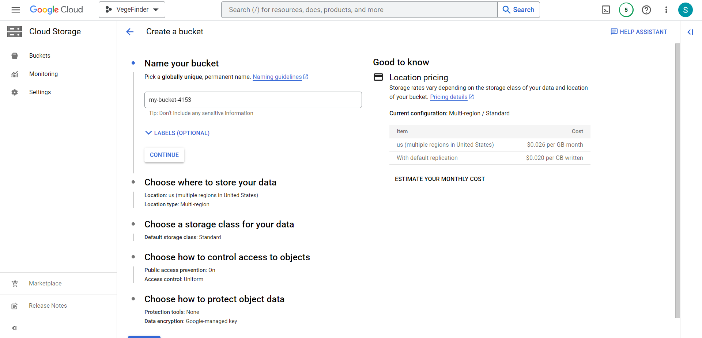
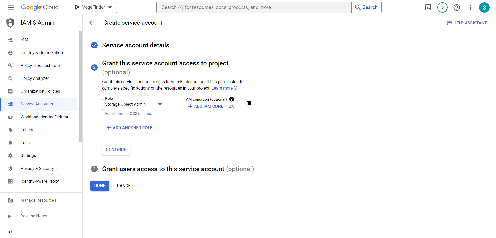

# VegeFinder API

---

## Description

This is the API for VegeFinder Application

## Requirements

-   Laravel 10
-   PHP 8.1
-   Google Cloud Storage (GCS)

## Installation

#### Google Cloud Storage

Create new project on your Google Cloud console & create new bucket on Cloud Storage with unique name

    

Create new service account and grant Storage Object Admin Role

    

Generate new key move to base path and rename to "service-account.json"

#### Laravel

Please check the official laravel installation guide for server requirements before you start. [Official Documentation](https://laravel.com/docs/5.4/installation#installation)

Clone the repository

    git clone https://github.com/nineneel/vegefinder-api.git

Go to the repo folder

    cd vegefinder-api

Install all the dependencies using composer

    composer install

Copy the example env file and make the required configuration changes in the .env file

    cp .env.example .env

Run the database migrations (**Set the database name in .env before migrating**)

    php artisan migrate

Start the local development server

    php artisan serve

You can now access the server at http://localhost:8000

**Make sure you set the correct database connection information before running the migrations** [Environment variables](#environment-variables)

    php artisan migrate
    php artisan serve

## License

Licensed under the MIT License - see the LICENSE file for details
